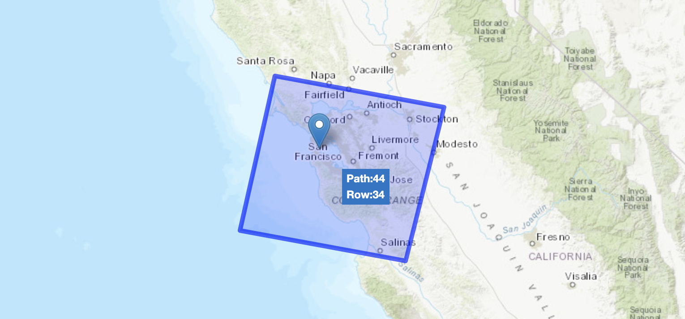
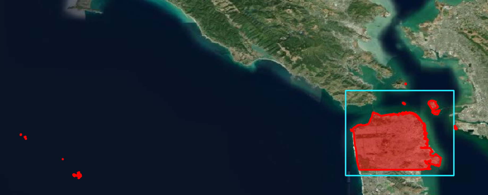
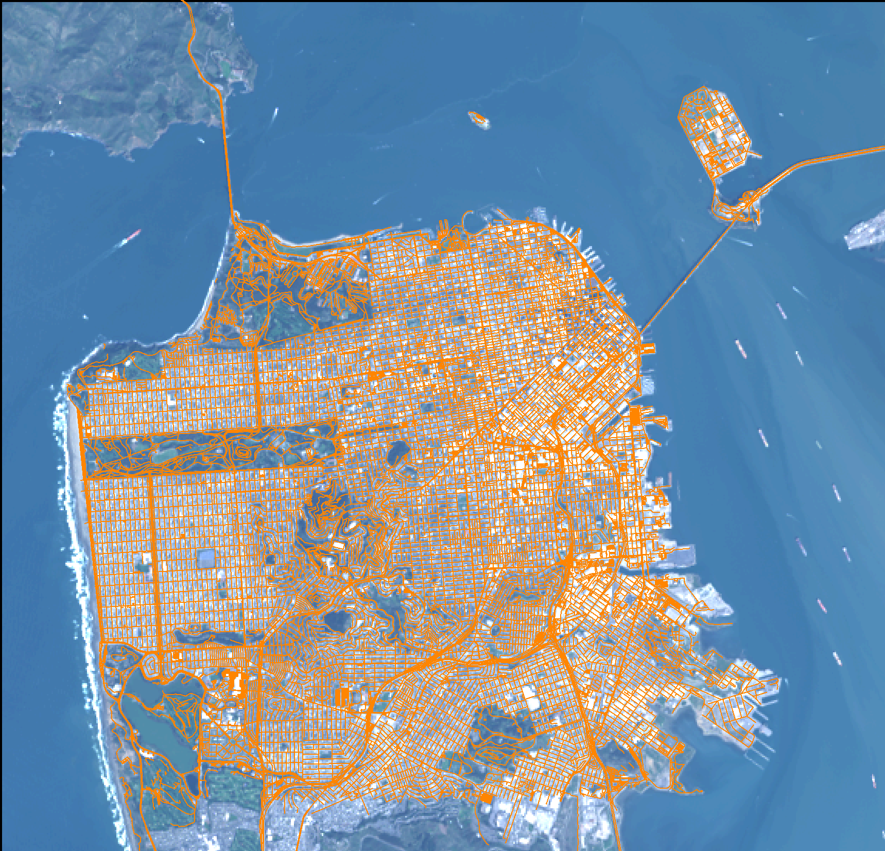

# Road map for San Francisco

## Download Landsat image for San Francisco

Path and row for San Francisco are found in https://landsat.usgs.gov/landsat_acq#convertPathRow



For these path and row download bands B04, B03, B02 (red, green, blue) from AWS. Choose the date with the minimum cloudy cover for 2021.

## Preprocess Landsat image

Coordinates for San Francisco boundaries (red polygons) are available for downloading:

https://data.sfgov.org/Geographic-Locations-and-Boundaries/Bay-Area-Counties/s9wg-vcph

However, lets create extension (blue polygon) for better visualization focused on the main region with roads. 



Preprocessing steps:
* Normalization
* Convert from uint16 to uint8
* Brightness and contrast enhancement
* Interpolation for better roads visualization

Georeferenced true color image is saved in [tci.jpg](https://github.com/LanaLana/road_map_analytics_demo/blob/main/tci.jpg)


## Download road map

Dataset with roads for San Francisco is downloaded from

https://mygeodata.cloud/data/download/osm/roads/united-states-of-america--california/san-francisco-city-and-county

**Description:** All road types for all types of vehicles - motorway (highway), trunk, primary / secondary / tertiary roads, living street, track, cycleway

**Layer sources:** Open Street Map 

**Change coordinate system:** from EPSG:4326 to EPSG:32610

Convert lines to polygons with buffer 10

Georeferenced image with road map is saved in [map.jpg](https://github.com/LanaLana/road_map_analytics_demo/blob/main/map.jpg)



## Run experiments

See [Road_map_SF.ipynb](https://github.com/LanaLana/road_map_analytics_demo/blob/main/Road_map_SF.ipynb) with experiments.

To run Docker for Landsat image downloading and processing:

```bash
docker build -t road_map .
docker create road_map
docker run -it --memory='2g' -v "${PWD}:/user" road_map /bin/bash python3 road_map_SF.py
```

For running on Mac these commands can be required:

```bash
docker-machine restart
eval $(docker-machine env default)
```

## Data description
Input files:

    * geojson road map:         'roads_buffered.geojson'
    
Output files:

    * dir with Landsat rgb:     './[productId]/[...]'
    * dir with crop Landsat:    './crop'
    
    * geojson study area:       'extention.geojson'
    * georef norm RGB image:    'tci.jpg'
    * georef road map:          'map.jpg'
